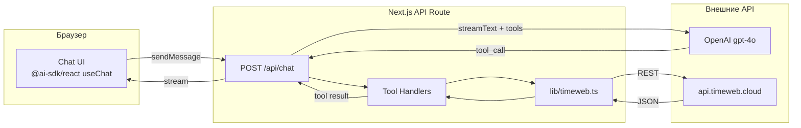

# Timeweb Chat Manager — План реализации

## Актуальные версии (проверено через context7)

- **Next.js**: v16.x (latest через `create-next-app@latest`), App Router, Tailwind CSS v4
- **AI SDK**: `ai` v5.x (`streamText`, `tool`, `UIMessage`, `convertToModelMessages`, `stepCountIs`, `toUIMessageStreamResponse()`)
- **@ai-sdk/react**: v5.x (`useChat` с `sendMessage` + `message.parts` API)
- **@ai-sdk/openai**: auto-resolved через строку `'openai/gpt-4o'`
- **shadcn/ui**: `shadcn@3.5.0` (Tailwind v4, config пустой)
- **zod**: для input-схем tools
- **react-markdown** + **remark-gfm**: рендер markdown в ответах LLM

## Архитектура




## Структура файлов

```
timeweb-api-chat/
├── .env.local
├── app/
│   ├── layout.tsx
│   ├── page.tsx
│   ├── globals.css
│   └── api/chat/route.ts
├── components/
│   ├── chat.tsx
│   ├── message.tsx
│   ├── chat-input.tsx
│   ├── sidebar.tsx
│   └── server-card.tsx
├── lib/
│   ├── timeweb.ts
│   ├── tools.ts
│   └── utils.ts
└── types/
    └── timeweb.ts
```

## Шаг 1: Scaffolding проекта

- `npx create-next-app@latest . --typescript --tailwind --app --turbopack --yes`
- Установка зависимостей:

```bash
  npm install ai @ai-sdk/openai @ai-sdk/react zod react-markdown remark-gfm
  npx shadcn@latest init --defaults
  npx shadcn@latest add button input scroll-area avatar separator
  

```

- Создание `.env.local`:

```
  TIMEWEB_TOKEN=...
  OPENAI_API_KEY=...
  

```

## Шаг 2: Типы и Timeweb API клиент

### `types/timeweb.ts`

Типы для серверов, пресетов, ОС, ответов API:

- `TimewebServer` (id, name, status, ip, os, preset, created_at, comment...)
- `TimewebPreset` (id, cpu, ram, disk, price, bandwidth...)
- `TimewebOS` (id, name, version, family...)

### `lib/timeweb.ts`

Обертка над Timeweb Cloud REST API (`https://api.timeweb.cloud/api/v1`):

- `listServers()` — GET `/servers`
- `getServer(id)` — GET `/servers/{id}`
- `createServer(params)` — POST `/servers` (name, os_id, preset_id, bandwidth)
- `deleteServer(id)` — DELETE `/servers/{id}`
- `serverAction(id, action)` — POST `/servers/{id}/action` (start/shutdown/reboot)
- `listPresets()` — GET `/presets/servers`
- `listOS()` — GET `/os/servers`
- `getBalance()` — GET `/account/finances`

## Шаг 3: LLM Tools и API Route

### `lib/tools.ts`

Определение tools через AI SDK v5 `tool()` + `zod` схемы:

```typescript
import { tool, ToolSet } from 'ai';
import { z } from 'zod';
import * as tw from './timeweb';

export const tools = {
  list_servers: tool({
    description: 'Получить список всех облачных серверов',
    inputSchema: z.object({}),
    execute: async () => await tw.listServers(),
  }),
  create_server: tool({
    description: 'Создать новый облачный сервер',
    inputSchema: z.object({
      name: z.string(),
      os_name: z.string(),
      ram_mb: z.number().optional(),
    }),
    execute: async (params) => { /* подбор preset/os + создание */ },
  }),
  // ... delete_server, server_action, get_server, list_presets, get_balance
} satisfies ToolSet;
```

### `app/api/chat/route.ts`

API route с `streamText`, system prompt на русском, `stopWhen: stepCountIs(5)`:

```typescript
import { streamText, convertToModelMessages, UIMessage, stepCountIs } from 'ai';
import { tools } from '@/lib/tools';

export async function POST(req: Request) {
  const { messages }: { messages: UIMessage[] } = await req.json();
  const result = streamText({
    model: 'openai/gpt-4o',
    system: SYSTEM_PROMPT,
    messages: await convertToModelMessages(messages),
    stopWhen: stepCountIs(5),
    tools,
  });
  return result.toUIMessageStreamResponse();
}
```

## Шаг 4: ChatGPT-like UI

### `app/layout.tsx`

Темная тема, шрифт Inter/Geist, метаданные.

### `components/chat.tsx`

Основной компонент с `useChat` из `@ai-sdk/react`:

```typescript
const { messages, sendMessage, isLoading, input, setInput } = useChat();
```

Рендер `message.parts` (text / tool-*)

### `components/message.tsx`

- Аватарки (user/assistant)
- `react-markdown` + `remark-gfm` для markdown-ответов
- Специальный рендер для tool-результатов (карточки серверов)

### `components/chat-input.tsx`

- Textarea с авторесайзом
- Кнопка отправки (стрелка вверх)
- Обработка Enter/Shift+Enter

### `components/sidebar.tsx`

- Лого "Timeweb Manager"
- Кнопка "Новый чат"
- Примеры запросов (quick actions)

### `components/server-card.tsx`

- Карточка сервера в ответе (имя, IP, статус, ОС, RAM)
- Цветовая индикация статуса (зеленый/желтый/красный)

### Цветовая схема (ChatGPT-dark)

- Фон: `#212121`, сайдбар: `#171717`, карточки: `#2f2f2f`
- Текст: `#ececec`, акцент: `#10a37f` (бирюзовый)

